<!-- retrato em ASCII (se digita linha a linha) ao lado de um cartão estilo neofetch.
     as larguras 370 + 490 = 860 batem com a largura do gráfico de contribuições.
     retrato:  python scripts/prep_photo.py source-photo.jpg && python scripts/make_ascii_svg.py
     cartão:   edite INFO em scripts/make_info_card.py e rode python scripts/make_info_card.py -->

<h3><code>gabriel@github ~ $ whoami</code></h3>

<table>
<tr>
<td valign="top"></td>
<td valign="top"></td>
</tr>
</table>

 

<!-- gráfico de contribuições com dados reais, atualizado todo dia por
     .github/workflows/update-profile-art.yml -->

<h3><code>gabriel@github ~ $ ./contributions.sh</code></h3>

 
 

<h3><code>gabriel@github ~ $ ls ~/projects</code></h3>

| Projeto | O que é | Stack |
| --- | --- | --- |
| [**App Remédios**](https://github.com/GSerejo/App-remedios) · [vídeo](https://www.youtube.com/watch?v=M813-sd0z9c) | Lembrete de medicação para idosos e crianças: alarme no horário de cada remédio e, ao tomar, o cuidador recebe pelo WhatsApp a foto da cartela, o remédio, o dia e o horário | React Native · Expo · TypeScript |
| [**clone-tabnews**](https://github.com/GSerejo/clone-tabnews) · [site](https://gserejo.com.br) | Clone do TabNews em construção no Curso.dev: API em Next.js, PostgreSQL no Docker e testes de integração | Next.js · PostgreSQL · Docker · Jest |
| **Em breve** 🚧 | Novo projeto em construção | — |

 

<h3><code>gabriel@github ~ $ ./links.sh</code></h3>

<b>Estagiário de Desenvolvimento Full Stack · TypeScript · Python · Rust</b>

 

